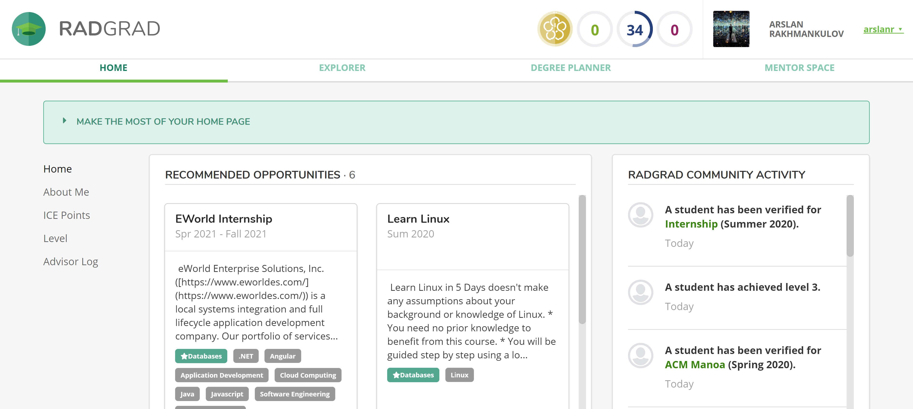
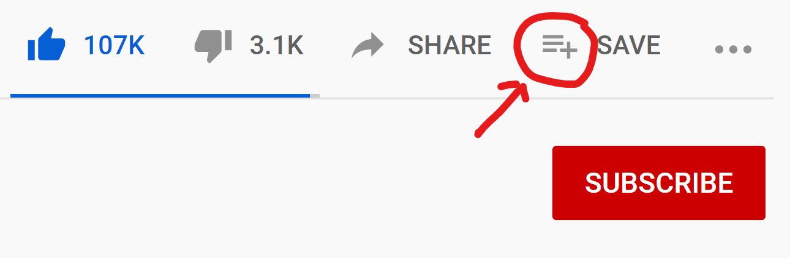
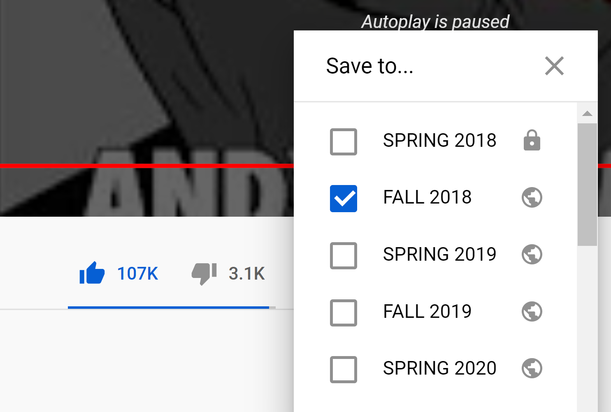

   Alright! Lets take a look at this. I havent seen this website since I first signed up for it, so lets rediscover what its all about. First impressions:

   
   
   
  
   I don’t really know where to start. The first thing that catches my eye is the opportunities part, and makes me want to look for internships. Awesome, I need those. What about the point system?

   To be honest, I don’t see the benefit of accumilating points to attain some level. I understand some people do strive to achieve a certain level of success or completion, but this not something that interests me. This might be selfish to say, but I am interested in doing things that would bring benefit to my future or help me in someway, such as opportunities or learning new skills. Tracking them with a point system is not something I can see bringing immediate benefit to myself. I understand that this feature is meant to organize a students pathway and help them be well rounded by making certain activities count towards certain levels. Maybe if this was more competetive I would strive to achieve some level that would give me an advantage or privilages. 

   I tried to add certain activities to semesters, but I found this is quite cumbersome to click on an opportunity just to read the description. Then add it to favorites, and then go back to my path way to throw it in a semester. I think a feature similar to what youtube has might work better. If one was to go into any video and click add to favorties, a drop down menu would pop up and you can select which playlist you want to add it to. I think we could steal this idea and implement it where each opportunity card can have the "add to favorites" feature, and a small drop down menu would appear listing the your semesters with a checkbox next to each one.

  As for the description, maybe we can include a "..see more" button that expands the description and enlarges the card. This way we can learn all about the opportunity and add it to whichever semester we want without jumping through hoops.

   What does interest me is a list of internships and hackathons. Maybe there could be a link thrown in there that leads to hackathon events. COVID caused a ton of these hackathons to virtual, and I suspect there would be more of these in the future. This is a great opportunity for Hawaii students as they may not be able to fly to the west or east coast to attend them. 

   Also, although I am interested in things like "learn linux" or cracking the coding interview, maybe it would make sense to split them apart from internships. Put them apart into a different "personal projects/learning" category?

   I looked around and saw that the CAREER GOALS tab would have been incredibly useful to me if I was a freshman. I think if I discovered all these career pathways earlier I would have utilized the website more because now I have a clear goal. What would be more interesting is to select a pathway, and have it autopopulate your degree planner with courses that would benefit this pathway, while also including prereqs in the earlier years. 

   As for the class pathway itself, maybe we could include a button that hides past courses if nescessary. With the extra space we could include a list of what each class is, their prereqs, and description. 
[Quite literally a list.](http://www.catalog.hawaii.edu/courses/departments/ics.htm)
 Simple, to the point. Search function might be fun. I reference this list a lot when selecting classes.

I also think It would be benefitial to add resume building resources. Maybe someone to check resumes or have opportunities to conduct white board/technical interview questions either as a group or individualy. 

We learn about datastructures in 311 and the code on how to implement them is given to us, but we never build any programs with it ourselves and that is a detriment. I would try to solve some easy leetcode or hackerrank questions and would realize that I know *a* solution, but need to look up how to implement it since I have never done it and don’t even know where to start. Of course doing said problems reveal that there are many more efficient ways to solve it, but I would need to look up how to implement those as well. Of course one could learn how to do all these problems, but would have been nice to get a head start. I have even pondered wether it might be a good idea to split up 311 into two semesters, but go more in depth and code up some data structures as we are learning them. 
