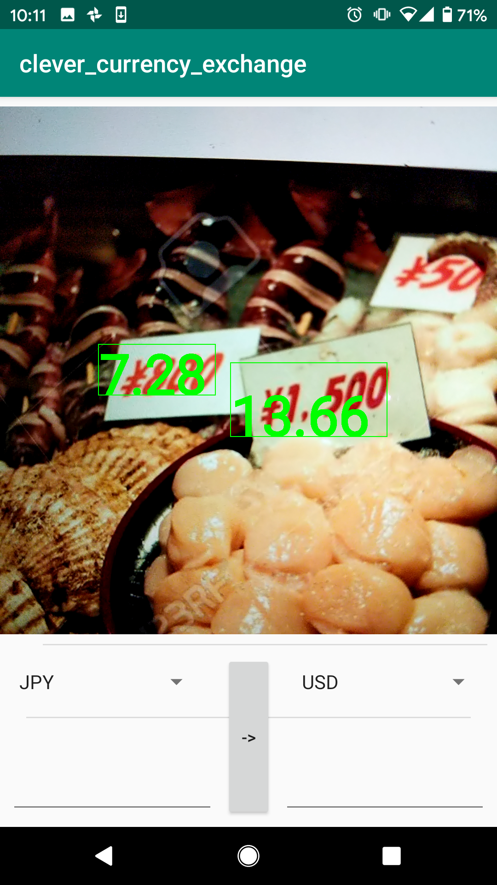
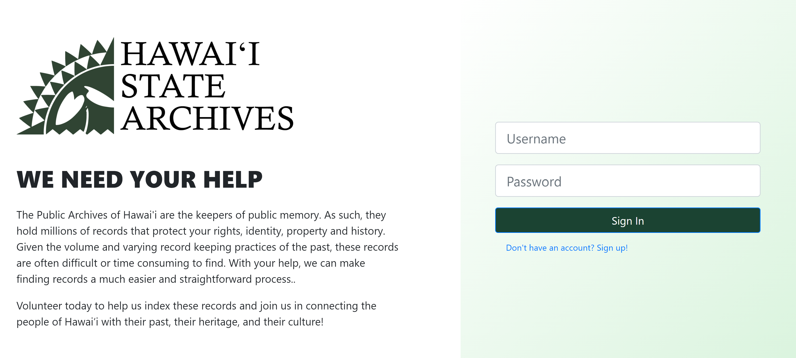
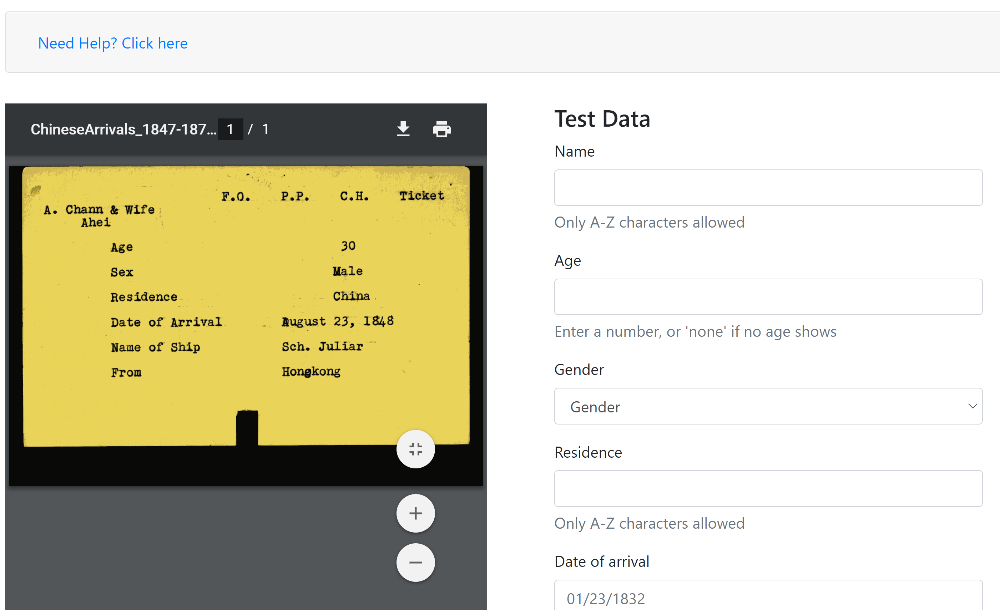
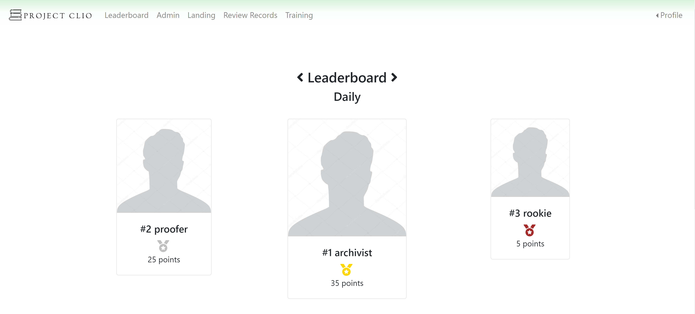
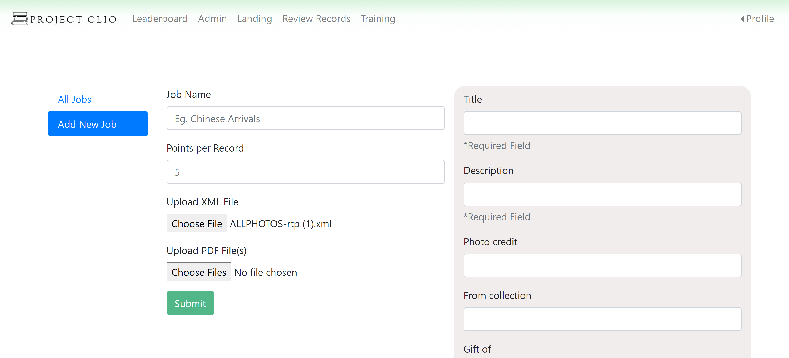
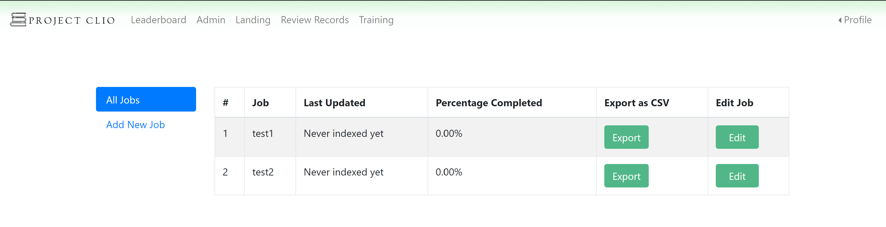
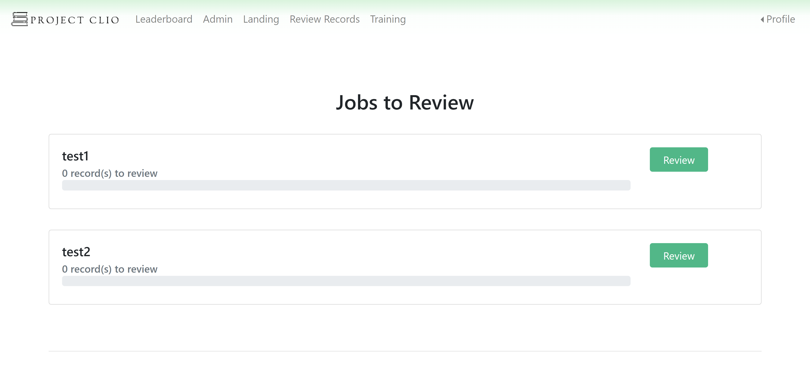

[Link](https://github.com/arslan-r/clever_currency_exchange) to the repository, along with additional notes.

In 2015, the Hawaii governor David Ige devised a plan to grow the local tech community and “strengthen the pipeline” for the tech industry in our state. Through this, the Hawaii Annual Code Challenge was born (HACC). Unlike a traditional hackathon, which lasts anywhere from 24 to 48 hours, the HACC breaks the mold and provides a multi-week experience. This encourages communication between participating teams and the sponsors and produces sustainable proof-of-concept solutions. 

One of the problems my team and I aim to solve is brought up by the Hawaii State Archives. Their goal is to “provide better end-user access to State Archive records”. The issue here, is that there is a ton of records to transcribe, and not enough manpower to do so. Additionally, given the volume and varying record keeping practices of the past, these records are often difficult or time consuming to find. To crowdsource these records, our team aims to implement gamification as an incentive measure. Setting up an adequate platform to provide users with the ability to connect to their past, but also be a part of rediscovering it will be our goal.

Our project allows the users to create an account and after a small tutorial, jump right into transcribing history. Users earn points for each job they perform, and through these points, they are placed onto monthly, daily, and all-time leaderboards to see who they rank up against. The users also earn badges based on certain things they accomplish, such as performing X amount of jobs. 

*How users index history!*

*Enough points will get you a spot on the leaderboard!*

On the admin side, the archivists have certain privileges to move their projects along. To easily create a job, which is a set of scanned PDF images that need to be transcribed, the admins can upload an XML file along with their selection of PDFs. After a user finishes recording data from a job, the admins can review their entry and accept it. After all the PDFs have been transcribed, the admins can export this data in a CSV file.

*Uploading an XML file generates fields. PDFs to index are also added here*

*Once a job is finished, admins can export the data*

Through this XML formatting, each job can be customized with that ever fields the admins deem necessary. Before, the inhouse employees would have to go through each job and do data entry. Now, the admins only need to create an XML file, and upload the PDFs. The crowdsourcing aspect of this project will take care of the rest.

*admins can approve or deny user entries*

This project could not have been done without my teammates, Gum, Jenny, Ken, and Trey. My responsibility at first was to create the front-end wireframes. After that was done, I focused on deploying the site. There were several options I could chose from, including Azure, the Google Cloud Platform, and AWS. In the end, I decided to deploy it to Microsoft Azure because Microsoft was one of the sponsors and I had past experience with the platform. As a bonus, Microsoft has Azure DevOps, which was something I never worked with, but glad I did. 

After the front end was done and deployed, and the back-end team got some features down, my team and I started putting the pieces together. I have never worked with RESTful APIs up to this point, so all of it was a major learning experience. Not too long after, the website was up and mostly functioning. There are still features we were working on, but I had a second to start making the website pretty. A little bit of color and animations can go a long way :)

Our project did have some hic-ups though. We built the front end with React, and the back end with Spring. For a simple create-react-app, it caused a lot of headaches, especially with deployment. When I first deployed it, none of the pages would link to each other, but would work locally just fine. Caused a real head scratcher, that one! Adding a few XML lines did the trick, but I found out that deploying can cause other issues too.

Another big issue we had was certain API calls would not go through due to a certain CORS policy. I could not get it to work, but in the spirit of a hackathon, we hacked around it by using a proxy. I would still like to try learning more about networking, as it is important. 

For the front end, I used React. Haven’t used it in a while, so it took some time to get back into gear, but once I started playing around, everything clicked. We used bootstrap to quickly set up the pages, which worked fantastic and was incredibly easy to use, but next time I would like to try MaterialUI. I tried it out for a bit and some pages can look absolutely stunning. Its pretty simple to understand, but forms are something that it doesn’t do well with. It’s a bit complicated but nothing one cant figure out. 

One big thing I learned is the use of Azure DevOps. I honestly did not intend to use it, just stumbled across it. It is super cool! It allows you to set up pipelines to manually or automatically deploy your project to the cloud. This is how it works. You hook up the your GitHub repo to Azure DevOps, give the console some commands to run, such as `npm install` and `npm run start`, and the project will update anytime the main branch is updated. From there, you can set it to deploy automatically, or set stages for it to go through. For this project, I set it to deploy automatically and it saved me a lot of headaches. Instead of building it manually and sending the built package up to the cloud, then waiting for it to (hopefully) work, we just update the main branch, and a few minute later its live! I will definitely be using this in my future projects.

Overall, it was a great experience. Learned a ton. Next time, I think I would try incorporating different kinds of technologies, maybe Express, or a different styling framework, such as MaterialUI. I would also love to explore different database options. This is my fourth hackathon, and through experience I found out it may not always be worth it to build a technically complex solution. A great idea is what matters. Next time, I would probably go for something super simple, but something I know I can execute well. This is easier said than done, as great ideas do not come by often. 

