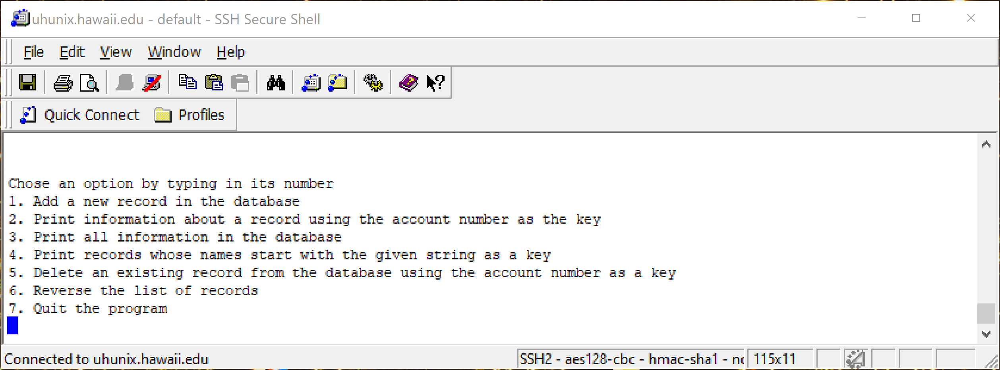
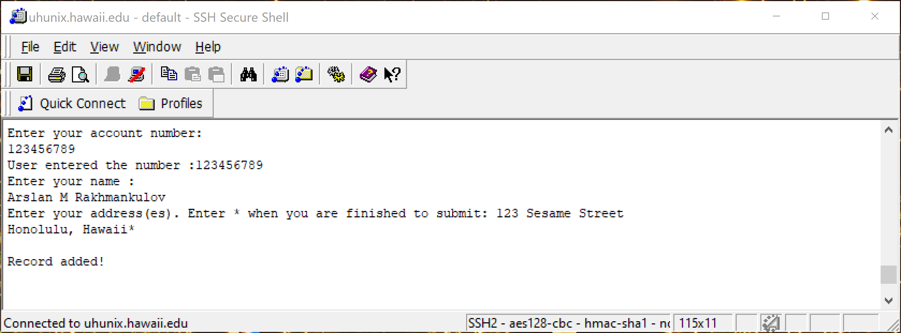
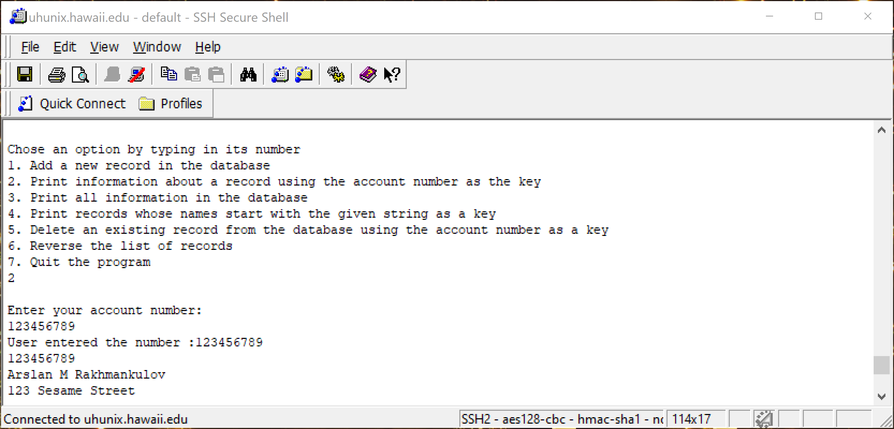

  ICS212 was a first step into the world of C and C++. Having passed that class I am comfortable saying that I have pretty decent understanding  of C and C++. This project demonstrates a database, something similar to an account management software.
  

  A user would be allowed to make a new record in the database by selecting the option to do so. They would input their account number, name and address, and the database would store it.
  
  
  
  We can retreieve records by their account number, as well as print all the records in the database (though having this option available to users of a multi-million account database is a scary thought!)
  PrintRecord.png
  
  

  
  We can also delete records using the users account number, or even delete the entire database entirely! (Another scary thought!). Later on in the project, I have added the ability to reverse this entire database. Since it is a link based one, it was a simple modification. One added feature is that the program will save itself before quitting, allowing all the records to be kept intact and reloaded when the database is relaunched. Useful for testing purposes! Re-entering all those records was a pain in the butt.
  
  
  [Full code could be found here.](https://github.com/arslan-r/account_management_database)
