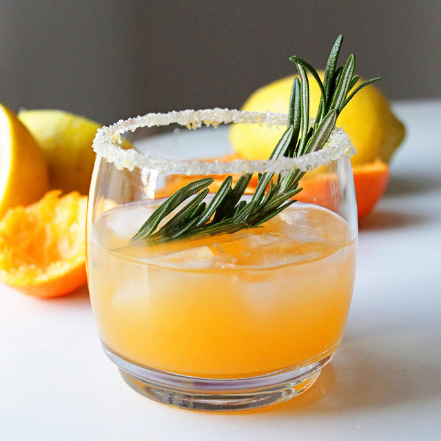

   I work in the service industry and have been for a couple years. I’ve been in every front of house position, starting from a host and being promoted to lead host, busser/runner, and eventually server and bartender. 

   One thing I noticed is how servers often have no clue as to the alcohol the restaurant serves. This is different from the menu cocktails, which I’m sure the servers can rattle off the top of their heads. The alcohol I am talking about comes in hard liquors and liqueurs. The problem here is if a guest asks for a specific spirit, the waiter would often run to the bar to check if they carried it. This causes major setbacks, especially if one has a million other things to do and several other tables to watch over.

   This problem had a simple solution. Create a specification sheet that carried all spirits in an easy to read yet small enough to carry form. In one of my waiter jobs I created this personally, the management thought this was a great idea, and had copies made to distribute to other servers. 

   When I was a bartender, I produced something similar, but had a different problem to overcome. We had an incredible number of fancy cocktails and one would have to learn fast if they were to be of any use to this fast-paced bar. All these recipes were stored in a large binder called the “Bar Bible” but it was cumbersome, and often took a while to find what one was looking for. Not to mention the pages were often sticky. To solve this, I created another specification sheet but this time it had every house recipe along with several others in an easy to carry, clean, and hide to seem professional form. This saved a lot of time and effort especially on busy nights and helped get new people up to speed because they had something small to reference that had everything they could need. This is opposed to a large binder that one had to flip though, especially when space is at a premium.
