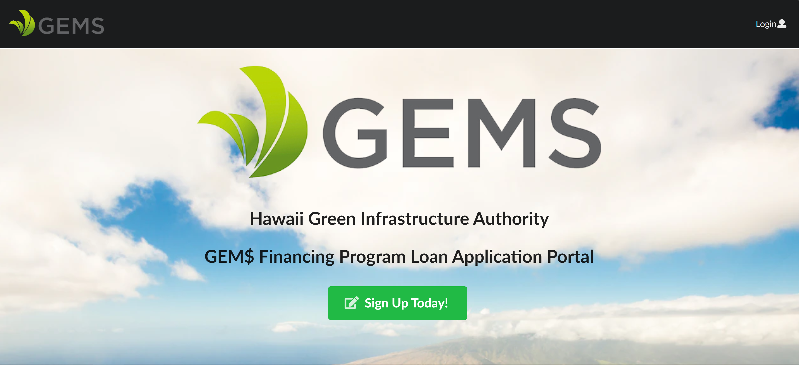
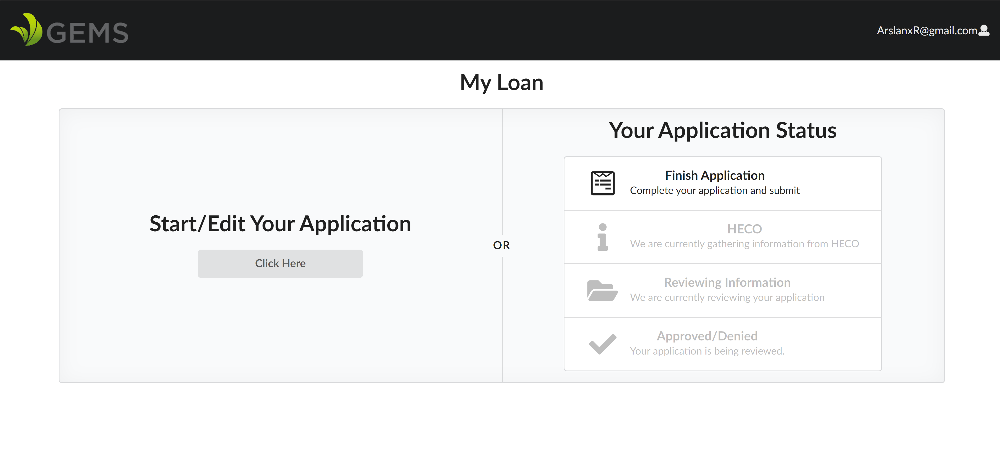
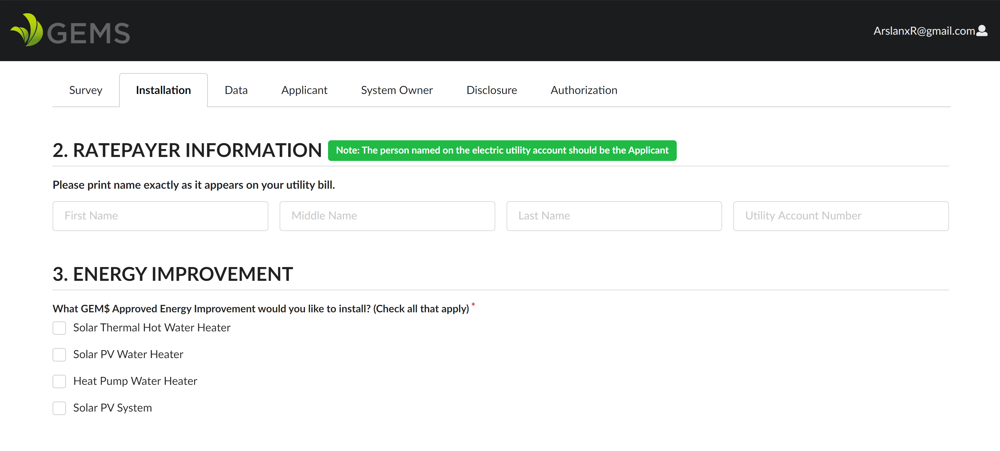
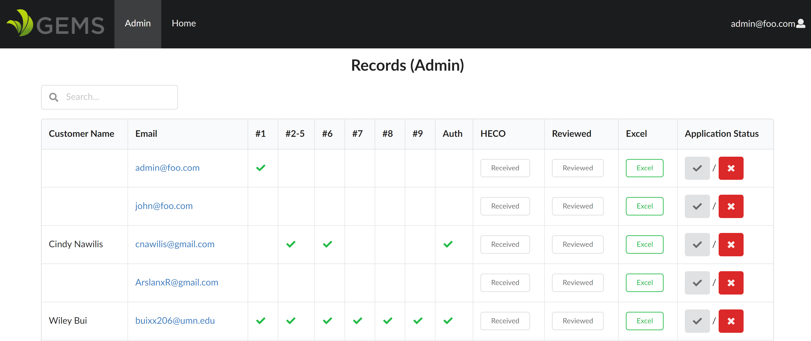

[THE PROJECT](http://simple-green-loans.meteorapp.com/#/)

  This portal was built for [GEM$ Hawaii](https://gems.hawaii.gov/learn-more/about-us/) with an aim to simplify the application process for both the applicants and the administrators. Taken from their website, "Hawaii Green Energy Market Securitization (GEMS) Program is bringing clean energy technologies to Hawaii ratepayers, including those who are underserved, by providing innovative financing products that result in electricity bill savings for customers with no money down."
  
  
  Their current application process involves the applicant printing out the PDF form, filling it out, signing it, and sending it back to the GEM$ team. The team recieves the file and manually inputs the handwritten information into their database. After which, they take certain forms and send it off to HECO and the nescessary contractors. 
  
  This process is repretetive and highly prone to errors. There is a lot of effort in simply processing each application. 
  
  

  "See a need, fill a need"

  
  

-Bigweld

  
  

My team and I improved on this by eliminating redundancies in the application process. Applicants can now log onto a portal and be taken step by step through the application process. The forms are clean, simple, easy to follow. They do not overwhelm the users by asking everything at once. 

One feature the GEM$ team asked for was the ability to sign off documents online, and we have provided that. Applicants can now sign their documents on screen and send it in as part of their submission. The GEM$ team are now able to extract this authorization and send it off to the Hawaiian Electric Company and other nescessary parties. 

A feature we implemented is the emailing system. When a user signs up, they recieve an email to confirm their email address. Where before, there would be a decent amount of communicating between GEM$ and applicants regarding the state of their application, with a click of a button, we are able to send reminders or update the status of their application. This is especailly useful if they are missing any information.

We were also tasked with implementing a way to extract the data and save it in an Excel file for their own record keeping. We  implemented the nescessary databases to store applicant's data, along with a feature to view all of their applicants, where they are in the process, what sections of the application need to be filled out, and generate Excel files for any and all individuals.

#### FEATURES ####
* Easy, simple way to apply for a loan
* Users are able to create accounts, fill out applications and save their progress
* Automated processing of applicants data
* Automated Email system
* Excel report generation
* Database querying of applicants
* User roles

As part of the team, I worked on the back end side of things. I implemented databases to store applicants data, and implemented and styled the forms applicants fill out. I also implemented the feature to extract data and generate Excel files. When needed, I also created and styled front-end parts of the project. 

As part of this team, I learned about Meteor, React, Semantic UI, and Uniforms. Furthermore, I developed my skills with JavaScript, HTML, and CSS.

