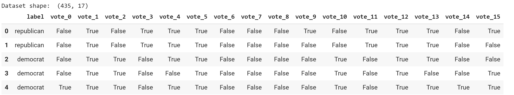
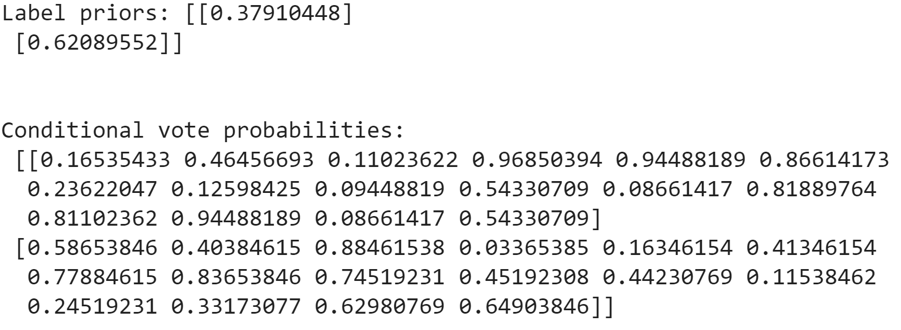
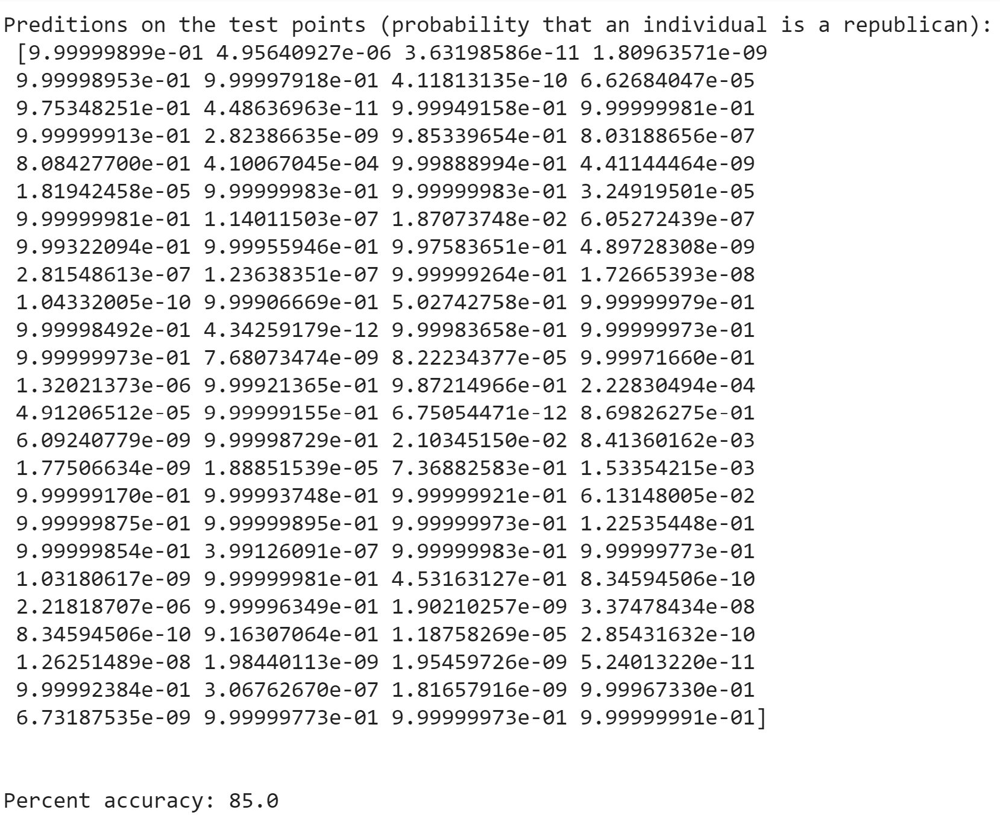

#### Naive Bayes

#### [THE PROJECT CODE](https://github.com/arslan-r/republican_or_democrat/blob/master/Naive_bayes.ipynb)

  

Naive Bayes will be used for this Machine Learning project. Explanation was obtained from this [website](http://theprofessionalspoint.blogspot.com/2019/03/advantages-and-disadvantages-of-naive.html).

Bayes theorem is represented with the following expression:

P(A|B) = P(B|A) * P(A) / P(B)

"Here, we calculate the probability of event A, given that event B has occurred. The right hand side of the equation consists of the probability of event B, given that event A has occurred, multiplied by the ratio of probability of event A to Probability of event B."

#### ADVANTAGES ####
 * Given that data points are independent from each other, this model has a decent performance.

 * Minimum training data is required

 * Easy to implement (bit of a head scratcher as I'm typing this though. It's ok I got this. Lets take is step by step.)

#### DISADVANTAGES ####
 * Data is assumed to be independent. It almost never is. A lot of variables depend on one another

 * If we dont train the model right, and it encounters a new variable in the test data, it would be impossible to predict data.

Data obtained from this [website](https://archive.ics.uci.edu/ml/datasets/Congressional+Voting+Records).
  
  
  
Direct calculations calculations would be described in the code.
These are the following results. Here I derive the label priors as well as the vote probabilities (the probability that an individual of both parties would vote 1 on a measure.) 

This data is later used to derive the probability that an individual is a Republican based on their vote history. One could derive the probability that an individual is a Democrat with some simple additional code. Here the model has an 85% accuracy.

  
