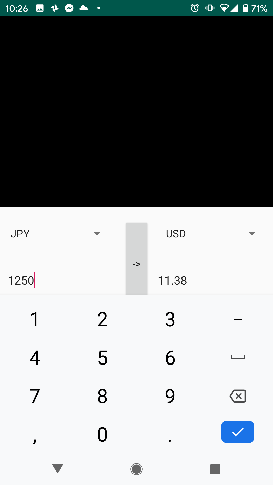

Ever travel to another country? Even the best of us have a tough time adjusting for a bit. This app lets you set the country rates to exchange and you are set. Point at any price tag and the app will convert it on screen for you. This is done through optical character recognition api provided by google, which I used it to fit the needs of this app.  Additionally, should you decide to type in some numbers you wish to convert, the app does the conversion at every single button press. This allows the user to simply input their numbers and eliminates the need for submitting their input. Overall, it is as "hands free" as an app could be. All you have to do is open the app and point. That’s it.

Here is an example of the phone being pointed at several price tags and processing all of them precisely. Note that there is no button to take a picture. However, the ability to take photos might be useful for record keeping purposes.

This demonstrates the ability to type. Note that there is no "enter" or "submit" button, as there is no need for it. 

This project is not being further pursued at the moment as there would be a running cost to obtain daily up to date exchange rates. One possible solution for this might go along the lines of hosting a website that runs a web scraper that looks up exchange rates. Still, however, there might be cost to hosting the site and the associated database.

[Link](https://github.com/arslan-r/clever_currency_exchange) to the repository, along with additional notes. 
